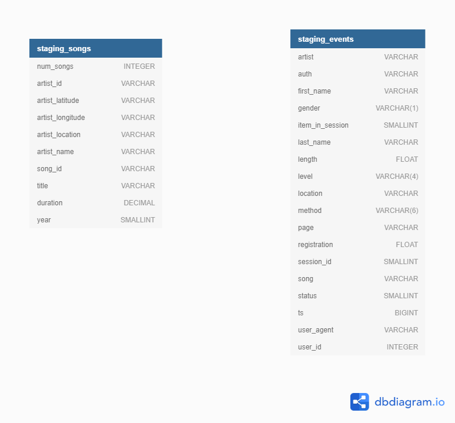
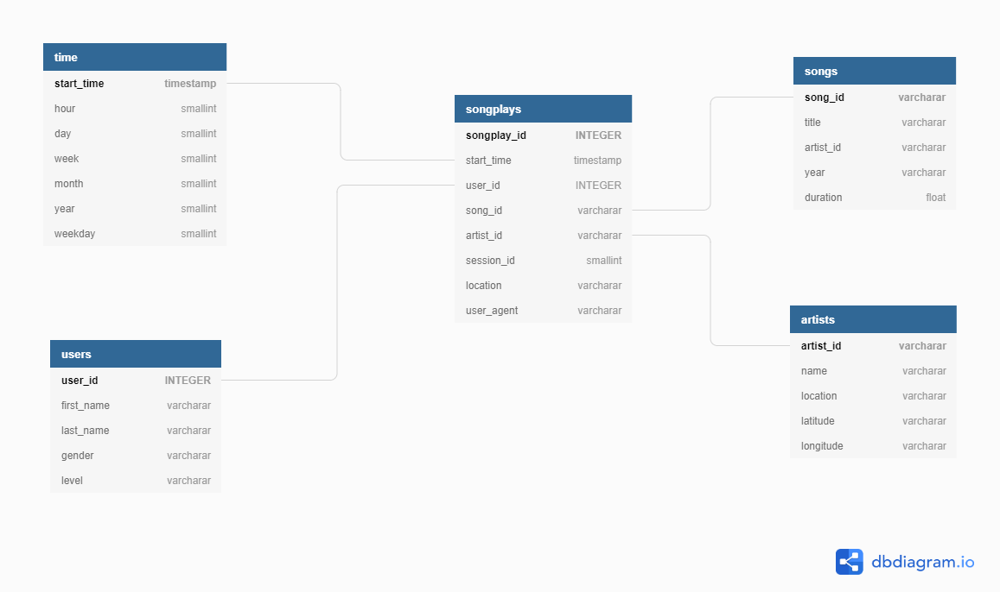

# Introduction

A music streaming startup, Sparkify, has grown their user base and song database and want to move their processes and data onto the cloud. Their data resides in S3, in a directory of JSON logs on user activity on the app, as well as a directory with JSON metadata on the songs in their app.

## Project Files
This project contains 3 python files and one config file:
1. sql_quires.py : contains all sql scripts for creating, droping and inseritng data to tables.
2. create_tables.py: contains python code that runs the script of creating and droping the tables.
3. etl.py contains python code which that runs copy json data from log files to staging tables and other tables.

## Schema Diagrams:

1. Staging tables diagram:

2. Main tables diagram:

## ETL Proces:
1. Create staging and main tables. I used distribution by key for songplay and song since they had bigger data the cannot be copy in all nodes. for users, time, artist I distribute them for all nodes, For staging_songs I distribute it even for all nodes. I used sort by key for all tables.
2. Copy log json data from all json files in s3://udacity-dend/log_data to staging_events.
3. Copy song json data from all json files in s3://udacity-dend/song_data to staging_songs.
4. Insert the data from staging_events and staging_events to :
    songplay, users, song, artist and time.

## Installation:
1. Run python create_tables.py on the terminal.
2. Run python etl.py on the terminal.

## NOTE:
    Delete your redshift cluster when finished To avoid extra costs.

## Resources:
    https://docs.aws.amazon.com/redshift/latest/dg/c_choosing_dist_sort.html
    https://stackoverflow.com/questions/29606368/convert-bigint-data-type-to-timestamp-and-subsequently-to-date-in-redshift
    https://dwgeek.com/redshift-extract-function-usage-and-examples.html/
    https://stackoverflow.com/questions/54637697/redshift-timestamp-conversion-that-retains-millisecond-percision
    https://docs.aws.amazon.com/redshift/latest/dg/copy-parameters-data-format.html
    https://docs.aws.amazon.com/redshift/latest/dg/r_COPY_command_examples.html
    https://docs.aws.amazon.com/redshift/latest/dg/r_Numeric_types201.html
    

